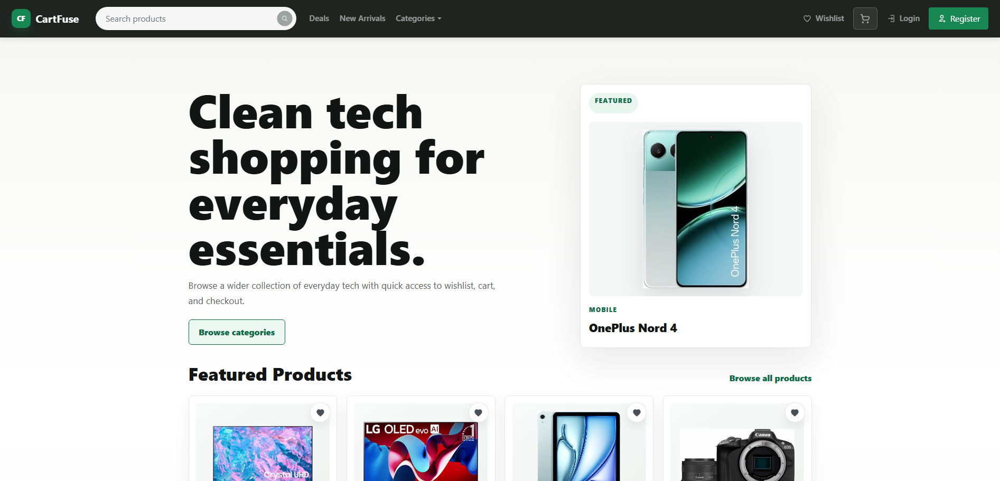

# Laravel E-Commerce Project

A Laravel-based e-commerce application originally built during vocational studies and later refined as a personal project.

The application includes storefront browsing, product pages, shopping cart and wishlist functionality, checkout, authentication, profile management, order history, and demo catalog data.


> This project is intended to be run locally for demonstration purposes.

## Features

- Browse featured products, deals, new arrivals, and product categories
- View individual product pages with pricing and product details
- Search products with suggestion support
- Add products to the cart and manage item quantities
- Save products to a wishlist and move wishlist items into the purchase flow
- Complete a simulated checkout flow with delivery address handling
- Register, log in, log out, and access account pages
- Manage profile and saved address information
- View order history and order status updates
- Cancel pending orders with cancellation reason support
- Access basic shipping and returns information pages

## Tech Stack

### Backend

- PHP 8
- Laravel 9
- MySQL
- Included `ecomm_en.sql` demo database
- Custom session-based authentication flow

### Frontend

- Blade templates
- HTML
- CSS
- JavaScript
- Laravel Mix / PostCSS

### Development Tools

- Composer
- npm
- PHPUnit

## Getting Started

These instructions are intended for running the project locally.

### Prerequisites

Make sure the following are installed on your machine:

- PHP 8.0.2 or newer
- Composer
- Node.js and npm
- MySQL
- Git

## Installation

Clone the repository:

```bash
git clone https://github.com/Lukas-Dev01/eCom-en-laravel.git
cd eCom-en-laravel
```

Install PHP dependencies:

```bash
composer install
```

Install frontend dependencies:

```bash
npm install
```

Create your environment file:

```bash
cp .env.example .env
```

On Windows PowerShell, use:

```powershell
Copy-Item .env.example .env
```

Generate the application key:

```bash
php artisan key:generate
```

Update your `.env` database settings:

```env
DB_CONNECTION=mysql
DB_HOST=127.0.0.1
DB_PORT=3306
DB_DATABASE=ecomm_en
DB_USERNAME=root
DB_PASSWORD=
```

The included SQL file can create the `ecomm_en` database for you during import.

## Quick Start

```bash
composer install
npm install
cp .env.example .env
php artisan key:generate
mysql -u root -p < ecomm_en.sql
npm run dev
php artisan serve
```

On Windows PowerShell, replace the `.env` copy command with:

```powershell
Copy-Item .env.example .env
```

## Database Setup

Use the included SQL dump for local setup:

```text
ecomm_en.sql
```

This file contains the current demo database, including the products and table structure. Import it once after configuring `.env`.

Example:

```bash
mysql -u root -p < ecomm_en.sql
```

If your MySQL root user has no password, use:

```bash
mysql -u root < ecomm_en.sql
```

After importing `ecomm_en.sql`, you usually do not need to run `php artisan migrate`. The SQL dump already creates the tables and loads the saved products and accounts. Only run migrations later if the project adds new database changes, and avoid `php artisan migrate:fresh` unless you intentionally want to reset the database.

## Demo Account

After importing the SQL dump, you can log in with this demo user or create your own account through the registration page:

```text
Email: john.smith@example.com
Password: password123
```

## Running the App

Compile frontend assets:

```bash
npm run dev
```

Start the Laravel development server:

```bash
php artisan serve
```

Open the app in your browser:

```text
http://127.0.0.1:8000
```

## Project Structure

```text
app/
  Http/Controllers/     Application controllers for products, cart, orders, and users
  Models/               Eloquent models for users, products, cart, wishlist, and orders

database/
  migrations/           Development schema history
  seeders/              Development seed data

resources/
  views/                Blade templates for storefront, account, cart, checkout, and orders
  css/                  Application styles
  js/                   Application JavaScript entry files

routes/
  web.php               Web routes for storefront, authentication, cart, wishlist, and account pages

public/
  css/, js/             Compiled frontend assets

ecomm_en.sql            Main MySQL database dump for local setup
```

## Order Status Notes

This project does not currently include an admin dashboard. For demo purposes, order statuses can be updated manually in the database through the `orders.status` column.

Supported status values:

```text
pending
processing
shipped
delivered
cancelled
```

Typical demo flow:

1. A customer places an order.
2. The order is saved with the `pending` status.
3. The status is manually changed in the database.
4. The user refreshes `/myorders`.
5. The updated status is displayed in the order history.

## Purpose and Learning Goals

This project was originally created during vocational studies as a practical Laravel learning project and later revisited to improve the codebase, structure, and overall presentation.

Key areas explored include:

- Laravel MVC architecture
- Authentication and session handling
- Cart, wishlist, checkout, and order flows
- Database structure and demo data organization
- Refactoring and improving an older codebase

## Scope and Limitations

This project focuses on the customer-facing e-commerce experience, including storefront browsing, product pages, cart and wishlist functionality, checkout flow, account management, and order history.

The following features are outside the current scope of the project:

- Full admin dashboard
- Automated order management
- Real payment processing
- Deployment infrastructure and production hosting
- Third-party service integrations

## License

This project is intended for educational and portfolio use.
